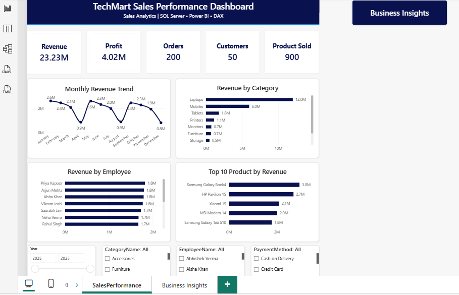

# TechMart Sales Analytics

## 📌 Project Overview

TechMart Sales Analytics is an end-to-end data analytics project focused on analyzing customer, sales, product, category, employee, and time-based performance.

The project uses SQL Server, Microsoft Excel, and Power BI to transform sales data into meaningful business insights and support data-driven decision-making.

---

## 🛠️ Tools & Technologies

- SQL Server
- Microsoft Excel
- Power BI
- Power Query
- DAX

---

## 🗄️ Data Model

The project uses a relational database containing interconnected tables for:

- Customers
- Orders
- Order Details
- Product
- Categories
- Employees

Relationships between these tables were used to combine data and perform business analysis.

---

## 🔄 Project Workflow

1. Designed and worked with a relational SQL database.
2. Queried and analyzed data using SQL Server.
3. Used joins to combine data from multiple tables.
4. Performed aggregation and business analysis using SQL.
5. Created reusable SQL Views for reporting.
6. Analyzed data using Microsoft Excel.
7. Developed an interactive Power BI dashboard.
8. Generated business insights from sales and performance data.

---

## 🔎 SQL Analysis

SQL Server was used to perform:

- Data filtering and sorting
- DISTINCT analysis
- Aggregate functions
- GROUP BY and HAVING
- INNER JOIN and LEFT JOIN
- Customer analysis
- Product analysis
- Category analysis
- Employee performance analysis
- Revenue and profit analysis
- Monthly, quarterly, and yearly analysis
- Top and bottom performer analysis
- Customers with no orders
- Products that were never sold
- Repeat customer analysis

---

## 📊 Business KPIs

The analysis focuses on:

- Total Revenue
- Total Profit
- Total Orders
- Total Customers
- Total Products Sold
- Revenue by Category
- Profit by Category
- Customer Revenue
- Product Revenue
- Employee Revenue
- Monthly Revenue
- Quarterly Revenue
- Yearly Revenue

---

## 👥 Customer Analysis

Customer analysis includes:

- Top customers by revenue
- Highest-spending customer
- Repeat customers
- Average revenue per customer
- Customers with no orders
- Customer registration analysis

---

## 📦 Product & Category Analysis

The project analyzes:

- Revenue by category
- Profit by category
- Top-performing category
- Least-selling category
- Number of products in each category
- Top products by revenue
- Bottom products by revenue
- Most-sold products
- Least-sold products
- Products that were never sold

---

## 👨‍💼 Employee Analysis

Employee performance was analyzed using:

- Revenue generated by employee
- Orders handled by employee
- Total quantity sold
- Profit generated
- Best-performing employee
- Employees with no orders
- Average revenue per employee

---

## 📅 Time Analysis

Sales performance was analyzed across:

- Monthly revenue
- Quarterly revenue
- Yearly revenue
- Highest-revenue month
- Average monthly revenue

---

## 👁️ SQL Views

Five reusable SQL Views were created for reporting and analysis:

- `vw_CustomerRevenue`
- `vw_ProductRevenue`
- `vw_CategoryRevenue`
- `vw_EmployeePerformance`
- `vw_MonthlyRevenue`

These views provide reusable summarized datasets for customer, product, category, employee, and monthly performance analysis.

---

## 📊 Excel Analysis

Microsoft Excel was used for sales analysis, data summarization, and reporting.

The analysis includes:

- Sales and profit analysis
- Pivot-based analysis
- KPI analysis
- Product performance
- Regional/business performance analysis

---

## 📈 Power BI Dashboard

An interactive Power BI dashboard was developed to visualize sales performance and key business KPIs.

The dashboard provides an interactive view of sales and profitability performance.

---

## 💡 Business Insights

The project was used to identify:

- High-performing and low-performing products
- Revenue and profit patterns across categories
- Customer revenue contribution
- Employee performance differences
- Monthly and yearly sales trends
- Products with no recorded sales
- Customers with no recorded orders

---

## 📁 Project Files

- `TechMart_Sales_Analytics.sql` — SQL analysis queries
- `TechMart_SQL_Views.sql` — SQL Views
- `TechMart_Sales_Analysis.xlsx` — Excel analysis
- `TechMart_Sales_Dashboard.pbix` — Power BI dashboard
- `Dashboard/TechMart_Sales_Dashboard.png` — Dashboard preview

---

## 👤 Author

**Abdullah Waqar Ansari**

Aspiring Data Analyst | SQL | Excel | Power BI | Data Analytics
